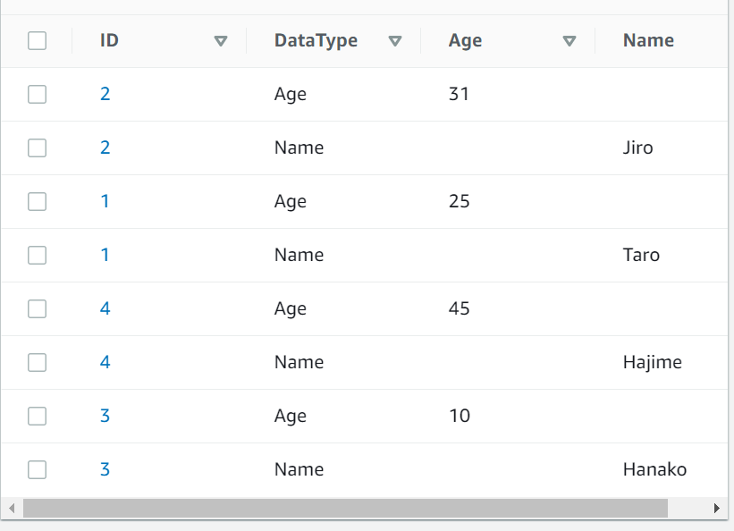
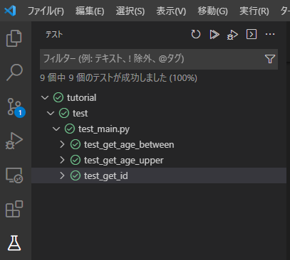

# バックエンドチュートリアル

## 1. ユーザ情報取得機能の作成（ローカルコンテナ）
- DynamoDBに登録されているユーザ情報を取得する関数を作成する。
- 関数は、ユーザIDによる取得、年齢幅に属するユーザの取得の2つの関数を作成する。
### 補足
- 年齢幅による取得はユーザIDの昇順で返却する。
- テストのためにDynamoDBが必要となる。DynamoDBのコンテナ立ち上げ及びテーブルの構築のために、バックエンドコンテナ内で以下のコマンドを実行する
```bash
docker run -d --name dynamodb -p 8000:8000 --net=pomodoro-timer amazon/dynamodb-local 
cd /root/workspaces/pomodoro-backend/tutorial
python create_db.py
```

- DynamoDBの設計及びデータイメージは以下となる。また、グローバルセカンダリインデックス名はDataType-Age-Indexである  

| ID(PK) | DataType(SK/GSI-PK) | Age(GSI-SK) | Name(Attr) |
| :---: | :---: | :---: | :---: |
| {ID} | Age | {Age} | - |
| {ID} | Name | - | {Name} |

  

- 各種関数は、バックエンドコンテナ内のtutolial/app/usecase.pyにある「get_user_by_id」、「get_user_by_age」に作成すること。ただし、引数及び戻り値は、関数に定義されているTypehintに従うこと。

- 各種関数の呼び出しは、tutorial配下のmain.pyによって呼び出されることを想定する。
- 各関数の上位への実装は行わないこと（pytestが正常動作しなくなる危険性がある！）
- boto3のresource、clientオブジェクトを生成する際に、アクセスキー等の各種パラメータの指定はしないこと。ただし、endpoint_urlのみは、環境変数（pythonにおけるos.environ）に"DYNAMODB_ENDPOINT"というキーが存在した場合その値を指定すること（存在しなければNoneを指定）
- 実装が完了した場合、tutorial/testに存在するtest_main.pyにて、pytestを実行する（VSCodeの拡張機能により実施）。そのテスト結果がすべて成功している場合、GitHubのIssuesに以下のようなテスト結果の画像を貼り付ける

<div align="center">
    
</div>

### 参考
- [サーバーレスアプリケーション向きのDB設計ベストプラクティス | AWS Black Belt](https://pages.awscloud.com/rs/112-TZM-766/images/20190905_%E3%82%A4%E3%83%81%E3%81%8B%E3%82%89%E7%90%86%E8%A7%A3%E3%81%99%E3%82%8B%E3%82%B5%E3%83%BC%E3%83%8F%E3%82%99%E3%83%BC%E3%83%AC%E3%82%B9%E3%82%A2%E3%83%95%E3%82%9A%E3%83%AA%E9%96%8B%E7%99%BA-%E3%82%B5%E3%83%BC%E3%83%8F%E3%82%99%E3%83%BC%E3%83%AC%E3%82%B9%E3%82%A2%E3%83%95%E3%82%9A%E3%83%AA%E3%82%B1%E3%83%BC%E3%82%B7%E3%83%A7%E3%83%B3%E5%90%91%E3%81%8D%E3%81%AEDB%20%E8%A8%AD%E8%A8%88%E3%83%98%E3%82%99%E3%82%B9%E3%83%88%E3%83%95%E3%82%9A%E3%83%A9%E3%82%AF%E3%83%86%E3%82%A3%E3%82%B9.pdf)
- [boto3公式リファレンス(DynamoDB)](https://boto3.amazonaws.com/v1/documentation/api/latest/reference/services/dynamodb.html#service-resource)

## 2. AWS Lambdaへのデプロイ
- 1.にて作成した各関数を利用するAWS Lambda関数を作成する。
- 作成するリージョンは東京リージョン（ap-northeast-1）とすること。
- 接続先DynamoDBは既に作成済みのため、改めて作る必要はない。
- 完了したら、githubのIssuesに、作成したAWS LambdaのARNを記述すること。