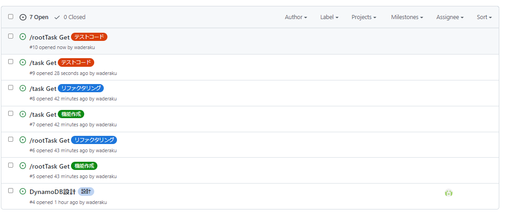

## 共通
- 作業をする前に必ず対応するIssuesに自分をアサインする
- コミット時には現在実施しているIssuesの番号を記入(例:#86 XXXコンポーネント修正)
- ローカルブランチからリモートブランチのmasterには直にpushしない
    - 別名でリモートブランチを切って、そこからpull requestを出す
    - pull requestの名前にはissue番号を入れる(例:#86 XXXコンポーネント修正)

## バックエンド
- 本開発では[テスト駆動開発（TDD）](https://www.qbook.jp/column/20181009_713.html)に従って実装を行う
- そのため、「テストコードの実装」→「機能開発」→「リファクタリング」のサイクルを回していく
- それぞれにラベルしたIssuesが存在するため、対応したIssuesにアサインする
- IssuesはAPI単位で発行する。Issues名は「APIURI(/taskなど) HTTPメソッド名(Getなど)」の規則に従う
