# 認証フロー
   

## 補足
### ①Cognitoへ認証アクセス
- ログイン画面にて、Cognitoにて認証リクエストを行う。
- 本実装はCognitoUIを使用を想定。
### ②認証トークンをHTTPOnlyのCookieにセットする
- ①にて認証リクエストに成功したら、認証トークンを取得する。
- そのトークンをJavaScriptから操作できないようなHTTPOnlyのCookieにセットする。（XSS対策）
- そのために、一度Lambdaにトークンをヘッダーに入れてリクエストを行い、レスポンスにHTTPOnlyのCookieにセットする
### ③認証トークンを利用してCognitoに認可されたリクエストを実行
- ②にてCookieに登録した認証トークンをヘッダーに載せて（フロント側では意識しない）APIを叩くことで、認証が必要なAPIを実行させる