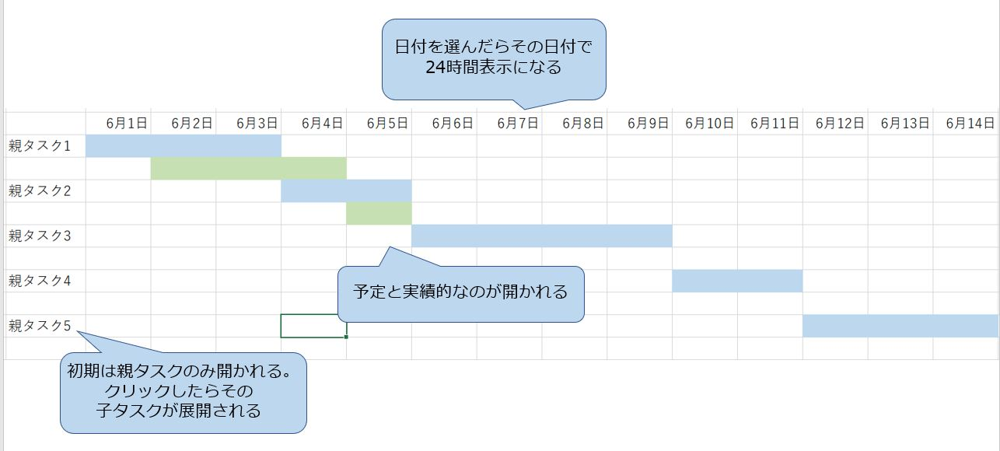
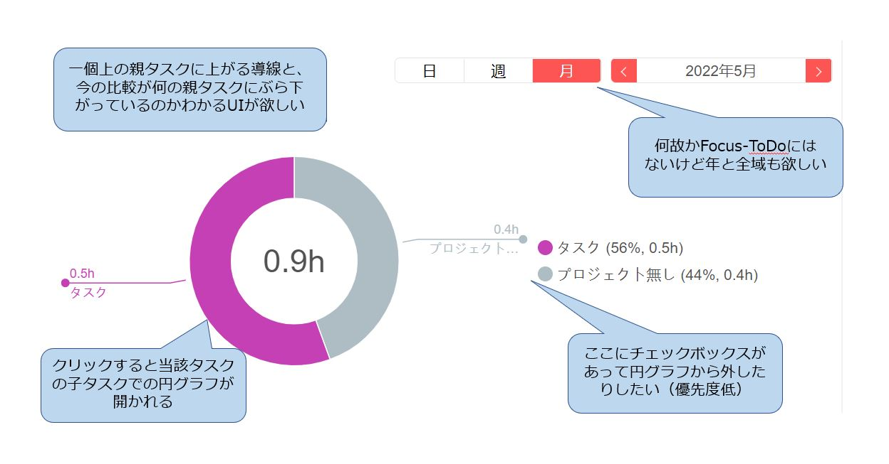
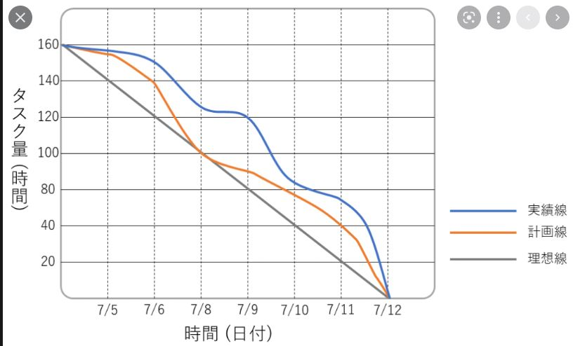

# 統計情報
## サマリー
- これまでに何時間作業したか的な情報が一覧で出る
- 基本的に単位は時間（h）

## ガントチャート
- 各タスクの作業予定及び作業実績が別色で表示される
- 横軸に時間軸、縦軸に各タスクが並ぶ
- タスクの順番は作業実績によってソート
- タスクの追加ができる

## 円グラフ
- 各タスクにかけた時間の比率を円グラフで確認できる
- 初期値はrootTaskレベルでの比較になる
- 円グラフに表示されているタスクをクリックすることで、そのタスクの子タスクに対する比較をした円グラフが開かれる

## バーンダウンチャート
- 横軸に時間、縦軸に作業時間があり、全体の作業時間の減少率を確認できる

