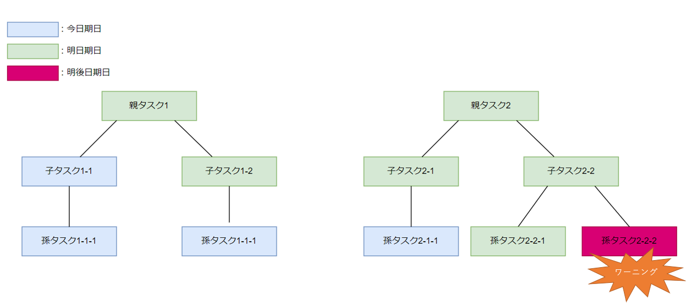

# 期日タスク
## 概要
- ユーザは期日を指定し、その期日までのタスク一覧を確認可能である
- 本ページでは、期日タスクの定義及びデータ構造について記載する

## 期日タスクの表示
- 期日タスクは、期日を指定された場合、その期日までのタスク一覧をタスクマネージャから確認が可能である
- タスクマネージャ上での見え方は、通常のタスク同様、ツリー構造をフォルダとして表現する  
一例として、以下のようなデータ構造を考える。
   

上記データ構造は、二つのルートタスクと複数の子タスクが存在している場合を想定している  
期日は、親タスク>子タスクとなるのが一般的なため、親タスク<子タスクとなるような新規タスクを作成する際には、ワーニングが出力される  
上記データ構造における、今日の期日タスクおよび明日の期日タスクは以下のようになる  

   

- 今日タスクについて、全てのタスクの内、期日が今日であるすべてのタスクが表示される。
- また、ルートタスクが明日までであっても、その子タスクの期日が今日までであれば、その子タスク以下の部分木を表示する
- 明日タスクについては、「明日まで」が期日であるすべてのタスクが表示される。そのため、今日が期日のタスクも表示されることになる。ただし、明後日以降が期日となるタスクは表示されない